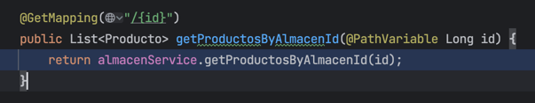
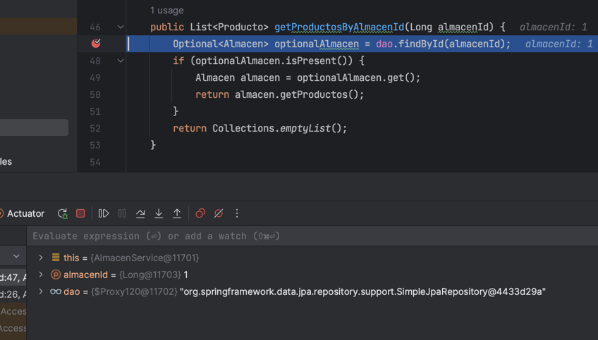
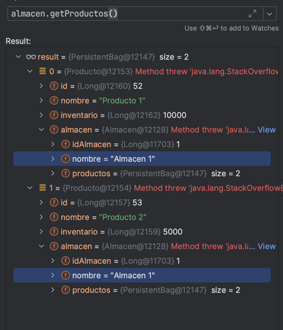
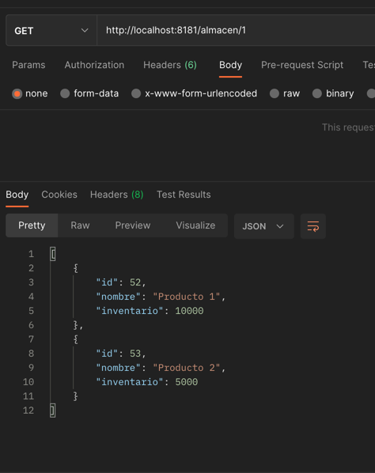
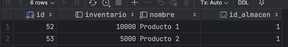

# CRUD with Spring Boot

This is a Java project built with Spring Boot that provides stores and product management functionalities. 
It includes several components such as controllers, services, repositories, and entity classes to handle stores and products.

## Features

- CRUD for products.
- ADD and FIND for stores.
- Search store by product id

## Technologies Used

- Java
- Spring Boot
- Spring Data JPA

## Getting Started

To get started with the project, follow these steps:

1. **Prerequisites**: Make sure you have Java and Maven installed on your system.(Java 17 is recommended, not necessary)
2. **Clone the repository**: Use Git to clone this repository to your local machine. link: 
3. **Build the project**: Open a terminal or command prompt and navigate to the project's root directory. Run the following command to build the project and resolve dependencies:

```shell
mvn clean install
```

4. **Run the application**: After the build is successful, you can run the application using the following command:

```shell
mvn spring-boot:run
```

5. **Access the API**: Once the application is running, you can access the API endpoints using a REST client or tools like Postman or your IDE provided one. The base URL for the API is `http://localhost:8181`.

6. **Properties**: The used properties were only needed for the database and spring.mvc.pathmatch.matching-strategy is defied, but I did not use it in the end.

7. **Evidences**:












## Acknowledgments

- [Spring Boot](https://spring.io/projects/spring-boot)
- [Spring Data JPA](https://spring.io/projects/spring-data-jpa)
- [java](https://dev.java/)